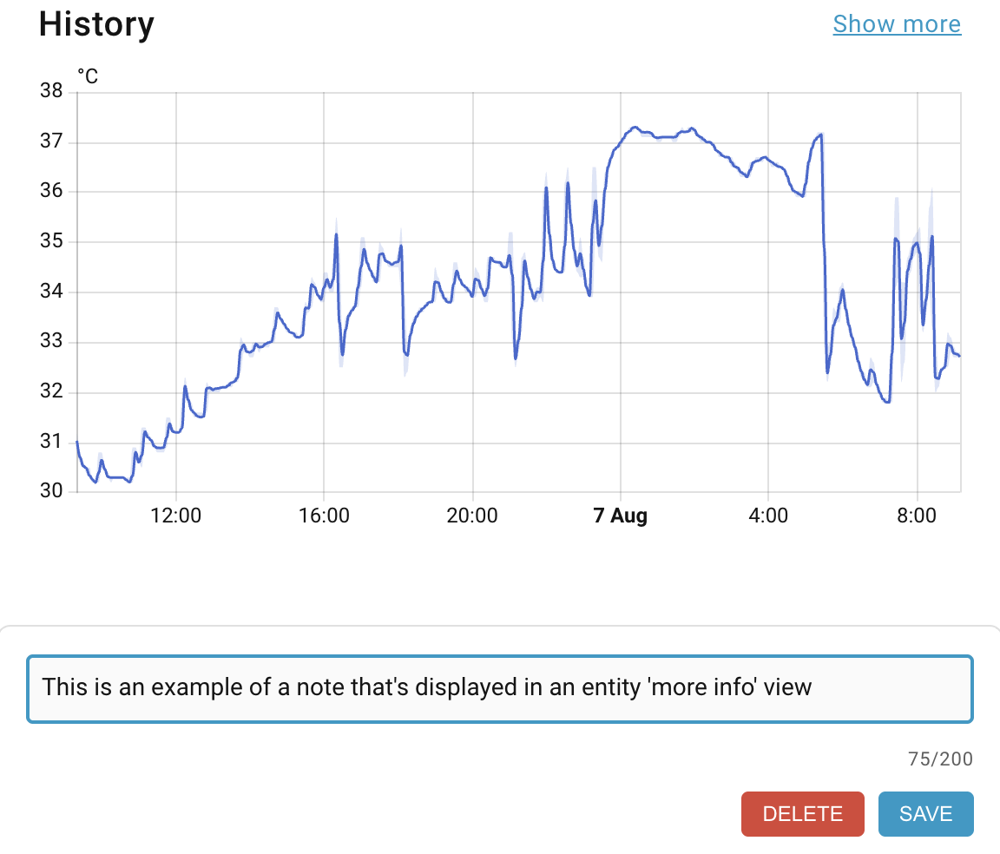

# Entity Notes for Home Assistant

[](https://github.com/hacs/integration)
[](https://github.com/martindell/ha-entity-notes/releases)
[](https://github.com/martindell/ha-entity-notes/issues)
[](https://opensource.org/licenses/MIT)

[](https://my.home-assistant.io/redirect/hacs_repository/?owner=martindell&repository=ha-entity-notes&category=integration)

A Home Assistant integration that allows you to add custom notes to any entity using the "more info" dialog. Perfect for documenting device locations, maintenance schedules, configuration details, or any other information you want to keep with your entities.

## Features

- 🗒️ **Add notes to any entity or device** - Works with all Home Assistant entities and devices (lights, sensors, switches, etc.)
- 💾 **Persistent storage** - Notes are saved permanently and survive restarts
- 🎨 **Auto-resizing textarea** - Input field automatically adjusts to content size
- 📱 **Responsive design** - Works on desktop and mobile
- 🔒 **Local storage** - All data stays on your Home Assistant instance
- ⚡ **Real-time updates** - Changes are saved instantly
- 🎯 **Configurable character limit** - Set maximum note length (50-2000 characters)
- 👁️ **Configurable button visibility** - Hide Save/Delete buttons when no notes exist
- 🔄 **Automatic backup integration** - Notes included in Home Assistant backups
- 🛠️ **Manual backup services** - Additional backup and restore services available

## Screenshot



The Entity Notes integration adds a notes section to every entity's "more info" dialog, allowing you to quickly add, edit, or delete notes associated with that entity.

## Installation

### HACS Installation (Recommended)

1. In Home Assistant, open **HACS → Integrations**
2. Search for **Entity Notes**
3. Install the integration
4. **Restart Home Assistant**

### Manual Installation

1. Download the latest release from the [releases page](https://github.com/martindell/ha-entity-notes/releases)
2. Extract the contents
3. Copy the `custom_components/entity_notes` folder to your Home Assistant `custom_components` directory
4. Restart Home Assistant

## Configuration

### Integration Setup

1. Go to **Settings → Devices & Services**
2. Click **"Add Integration"**
3. Search for **"Entity Notes"**
4. Click to add the integration
5. Configure your preferences:
   - **Enable debug logging**: Enable detailed logging for troubleshooting
   - **Hide buttons when no note exists**: Hide Save/Delete buttons when no note exists
   - **Enable automatic backups**: Notes are automatically included in Home Assistant backups
   - **Maximum note length**: Set character limit (50-2000 characters)

When you change any of these options, please reload the integration.  HA only registes these settings on integration load / reload.  You'll likely also need to clear browser cache to see the changes take effect too.  So much caching!

### Configuration Options

| Option | Description | Default | Range |
|--------|-------------|---------|-------|
| Debug Logging | Enable detailed logging for troubleshooting | `false` | true/false |
| Hide Buttons When Empty | Hide Save/Delete buttons when no note exists | `false` | true/false |
| Enable automatic backups | Include notes in HA backups | `true` | true/false |
| Maximum Note Length | Character limit for notes | `200` | 50-2000 |

#### Enable Debug Logging

**Purpose**: Provides detailed logging information for troubleshooting and development purposes.

**When to enable:**
- 🐛 **Troubleshooting issues**: When notes aren't appearing, saving, or loading correctly
- 🔍 **Development work**: When contributing to the project or customizing functionality  
- 📊 **Performance analysis**: To understand how the integration processes entity data
- 🚨 **Error investigation**: When experiencing unexpected behavior

**What it logs:**
- Entity ID detection and processing
- Note loading and saving operations
- Configuration changes and cache updates
- Frontend JavaScript initialization and errors
- API endpoint requests and responses
- Integration startup and shutdown events

**Log location**: Check **Settings → System → Logs** or your Home Assistant log files

**Example log entries:**
```
[custom_components.entity_notes] Entity Notes: Found entity ID: light.living_room
[custom_components.entity_notes] Note loaded successfully for sensor.temperature
[custom_components.entity_notes] Configuration updated: hide_buttons_when_empty=true
```

**⚠️ Important**: Disable debug logging in production environments as it can generate significant log volume.

#### Hide Buttons When No Note Exists

**Purpose**: Provides a cleaner, less cluttered user interface by hiding the Save and Delete buttons when an entity has no existing note.

**Visual behavior:**
- **When enabled (`true`)**:
  - 👁️ Buttons are **hidden** when the text area is empty AND no existing note exists
  - 👁️ Buttons **appear** as soon as you start typing or if a note already exists
  - 🎨 Creates a minimalist interface focused on entities that actually have notes
  
- **When disabled (`false`)**:
  - 👁️ Buttons are **always visible** regardless of note content
  - 🎨 Provides consistent interface across all entities

**Use cases:**

**Enable this feature if you:**
- 🎯 Want a cleaner, less cluttered interface
- 📱 Use mobile devices where screen space is limited
- 🔍 Prefer to focus attention on entities that actually have notes
- ✨ Like minimalist UI design

**Keep disabled if you:**
- 🎯 Want consistent button placement across all entities
- 🖱️ Prefer always-visible controls for quick access
- 👥 Have multiple users who might be confused by disappearing buttons
- 🔄 Frequently add/remove notes and want persistent controls

**Technical details:**
- Changes take effect immediately without restart
- Uses intelligent detection to show buttons when typing begins
- Remembers existing note state to show buttons appropriately
- Fully configurable per Home Assistant instance

**Example scenarios:**

```yaml
# Scenario 1: Clean interface preferred
hide_buttons_when_empty: true
# Result: Only entities with notes show buttons initially

# Scenario 2: Consistent interface preferred  
hide_buttons_when_empty: false
# Result: All entities always show Save/Delete buttons
```

## Usage

1. Click on any entity to open its "more info" dialog
2. Scroll down to find the **"📝 Notes"** section
3. Click in the text area to add or edit notes
4. Use the **"SAVE"** button to save your changes
5. Use the **"DELETE"** button to remove notes entirely

### Markdown Formatting

Notes support Markdown formatting. Here's everything that's supported:

```
# Title
## Subtitle
- Bullet item
- Another item
1. Numbered item
2. Another numbered item
**bold text**
*italic text*
---
https://example.com
```

Which renders as headings, lists, bold, italic, a horizontal divider, and a clickable link.

### Formatting Toolbar

To make formatting notes even easier, the editor includes a convenient toolbar above the text area when in edit mode. It provides one-click access to the most common formatting options:

*   **Undo/Redo (`↶` / `↷`)**: Reverts or restores the last action. Also accessible via standard keyboard shortcuts (`Ctrl+Z` / `Ctrl+Y`).
*   **Headings (`H1` / `H2`)**: Applies a heading style to the current line(s).
*   **Bold (`B`)**: Makes the selected text bold (`**text**`).
*   **Italic (`K`)**: Makes the selected text italic (`*text*`).
*   **Lists (`•` / `1.`)**: Formats the selected line(s) as a bulleted or numbered list. This feature intelligently handles multiple selected lines, creating correctly incremented numbered lists.
*   **Horizontal Rule (`—`)**: Inserts a horizontal rule (`---`) into the note.


### Tips

- The text area automatically resizes based on content
- Empty notes are automatically removed to keep storage clean
- Character count is displayed to help you stay within limits
- Configuration changes take effect immediately without restart

## Data Storage & Backup

Entity Notes provides comprehensive data protection through multiple backup mechanisms:

### Automatic Backup (Recommended)

**Your notes are automatically protected** through Home Assistant's built-in backup system:

- **Automatic inclusion**: Notes are stored in `.storage/entity_notes.notes` and automatically included in all Home Assistant backups
- **System-wide protection**: When you create a Home Assistant backup (manual or scheduled), your notes are included
- **Restore compatibility**: Notes are automatically restored when you restore a Home Assistant backup
- **No additional setup required**: This protection works out of the box

### Manual Backup Services

The integration also provides dedicated backup services for additional flexibility:

#### Available Services

| Service | Description | Usage |
|---------|-------------|--------|
| `entity_notes.backup_notes` | Create a manual backup of all notes | Call manually or via automation |
| `entity_notes.restore_notes` | Restore notes from manual backup | Call manually or via automation |

#### Manual Backup Details

- **Backup location**: `<config_directory>/entity_notes_backup.json`
- **Format**: Human-readable JSON file
- **Content**: All entity notes with their associated entity IDs
- **Use cases**: 
  - Before major system changes
  - Creating specific notes-only backups
  - Migrating notes between systems
  - Automated backup schedules

#### Example Automation for Scheduled Backups

```yaml
automation:
  - alias: "Backup Entity Notes Weekly"
    trigger:
      - platform: time
        at: "02:00:00"
    condition:
      - condition: time
        weekday:
          - sun
    action:
      - service: entity_notes.backup_notes
```

#### Manual Service Calls

**Create a backup:**
```yaml
service: entity_notes.backup_notes
```

**Restore from backup:**
```yaml
service: entity_notes.restore_notes
```

### Backup Best Practices

1. **Rely on Home Assistant backups**: Your notes are automatically protected through regular HA backups
2. **Use manual services for specific needs**: Create targeted backups before major changes
3. **Schedule regular backups**: Set up automations for additional protection
4. **Test restore procedures**: Verify your backup strategy works as expected

## API Endpoints

The integration exposes REST API endpoints for programmatic access:

- `GET /api/entity_notes/{entity_id}` - Retrieve note for an entity
- `POST /api/entity_notes/{entity_id}` - Save note for an entity (JSON: `{"note": "text"}`)
- `DELETE /api/entity_notes/{entity_id}` - Delete note for an entity

## File Structure

```
ha-entity-notes/
├── custom_components/
│   └── entity_notes/
│       ├── __init__.py           # Main integration logic and API endpoints
│       ├── manifest.json         # Integration manifest
│       ├── config_flow.py        # Configuration UI
│       ├── const.py              # Constants and configuration
│       ├── entity-notes.js       # Frontend JavaScript component
│       ├── services.yaml         # Service definitions
│       └── translations/
│           └── en.json           # English translations
├── hacs.json                     # HACS configuration
├── README.md                     # This documentation
└── info.md                       # HACS info file
```

### File Descriptions

- **`__init__.py`** - Contains the main integration setup, storage management, REST API endpoints, and backup services
- **`manifest.json`** - Home Assistant integration manifest defining dependencies, version, and metadata
- **`config_flow.py`** - Provides the configuration UI for setting up and modifying integration options
- **`const.py`** - Defines constants used throughout the integration
- **`entity-notes.js`** - Frontend component that injects the notes interface into entity dialogs
- **`services.yaml`** - Defines the backup and restore services exposed by the integration
- **`translations/en.json`** - English language translations for the configuration UI

## Services

### entity_notes.backup_notes

Creates a manual backup of all entity notes.

**Parameters:** None

**Example:**
```yaml
service: entity_notes.backup_notes
```

### entity_notes.restore_notes

Restores entity notes from a manual backup file.

**Parameters:** None

**Example:**
```yaml
service: entity_notes.restore_notes
```

### entity_notes.set_note

Programmatically set a note for an entity.

**Parameters:**
- `entity_id` (required): The entity ID to add a note to
- `note` (required): The note text

**Example:**
```yaml
service: entity_notes.set_note
data:
  entity_id: light.living_room
  note: "Replaced bulb on 2024-01-15"
```

### entity_notes.get_note

Retrieve a note for an entity (fires an event with the result).

**Parameters:**
- `entity_id` (required): The entity ID to get the note for

### entity_notes.delete_note

Delete a note for an entity.

**Parameters:**
- `entity_id` (required): The entity ID to delete the note from

### entity_notes.list_notes

Get all notes (fires an event with the result).

**Parameters:** None

## Troubleshooting

### Notes not appearing

- Clear browser cache and/or force refresh
- On mobile devices, clear the Home Assistant app cache
- Restart Home Assistant after configuration changes
- Check that the integration is properly loaded in **Settings → Devices & Services**

### Notes not saving

- Check Home Assistant logs for error messages
- Ensure the integration is properly installed and loaded
- Verify file permissions in the Home Assistant directory
- Check available disk space

### Configuration changes not taking effect

- Reload the integration to foce configuration changes
- Clear browser cache after configuration changes
- If issues persist, restart Home Assistant

### Browser console errors

- Open browser developer tools (F12) and check for JavaScript errors
- Ensure the script is loading properly: look for `entity-notes.js` in Network tab
- Check for Content Security Policy (CSP) violations

### Backup and restore issues

- Verify the backup file exists at `<config_directory>/entity_notes_backup.json`
- Check Home Assistant logs for backup service errors
- Ensure sufficient disk space for backup operations
- Verify file permissions for the config directory

## Contributing

Contributions are welcome! Please feel free to submit a Pull Request.

### Development Setup

1. Fork the repository
2. Create a feature branch
3. Make your changes
4. Test thoroughly
5. Submit a pull request

## License

This project is licensed under the MIT License - see the [LICENSE](LICENSE) file for details.

## Support

If you encounter any issues or have questions:

1. Check the [troubleshooting section](#troubleshooting)
2. Search existing [issues](https://github.com/martindell/ha-entity-notes/issues)
3. Create a new issue with detailed information about your problem
