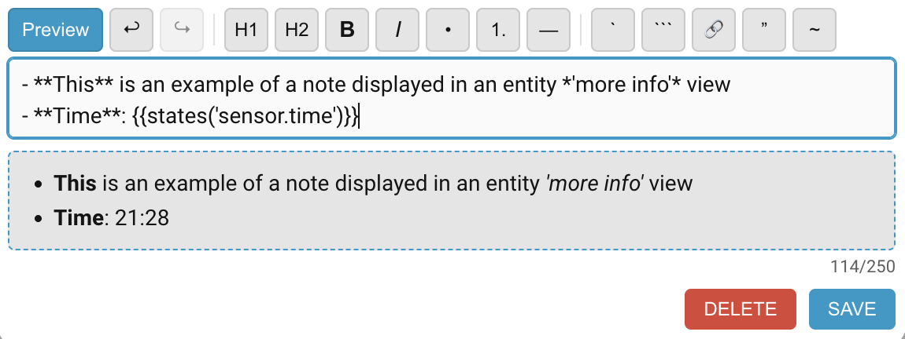
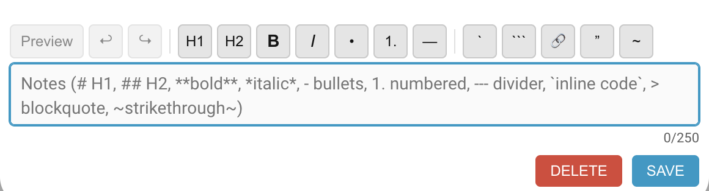

# Entity Notes for Home Assistant

[](https://github.com/hacs/integration)
[](https://github.com/martindell/ha-entity-notes/releases)
[](https://github.com/martindell/ha-entity-notes/issues)
[](https://opensource.org/licenses/MIT)

[](https://my.home-assistant.io/redirect/hacs_repository/?owner=martindell&repository=ha-entity-notes&category=integration)

Entity Notes adds a notes panel to Home Assistant entity and device dialogs, so you can keep maintenance details, battery replacement dates, wiring notes, and setup reminders next to the things they describe.

<p align="center">
  
</p>

## Features

- Add notes to Home Assistant entities and devices
- Format notes with Markdown using the built-in toolbar
- Preview Markdown and Jinja2 templates before saving
- Insert Home Assistant template values such as `{{ states('sensor.example') }}`
- Track when each note was last updated
- Keep notes across restarts using Home Assistant storage
- Include notes in regular Home Assistant backups
- Manage notes programmatically with Home Assistant services and REST endpoints
- Translated UI - contribute your language via a pull request

## Screenshots

### Note Editor

<p align="center">
  
</p>

### Live Preview

<p align="center">
  
</p>

## Installation

### HACS

1. In Home Assistant, open **HACS**.
2. Go to **Integrations**.
3. Search for **Entity Notes**.
4. Install the integration.
5. Restart Home Assistant.

### Manual

1. Download the latest release from the [releases page](https://github.com/martindell/ha-entity-notes/releases).
2. Extract the release archive.
3. Copy `custom_components/entity_notes` into your Home Assistant `custom_components` directory.
4. Restart Home Assistant.

## Setup

1. Go to **Settings -> Devices & services**.
2. Select **Add Integration**.
3. Search for **Entity Notes**.
4. Add the integration and choose your preferred options.

If a frontend option does not appear to change immediately, reload the integration and hard-refresh your browser or clear the Home Assistant app cache.

## Usage

1. Open an entity's **More info** dialog.
2. Scroll to the **Notes** section.
3. Add or edit your note.
4. Select **Save**.
5. Select **Delete** to remove the note.

Device notes work in the same way from device dialogs.

## Markdown And Templates

Notes support common Markdown:

````markdown
# Heading
## Subheading
- Bullet item
1. Numbered item
**bold**
*italic*
~~strikethrough~~
`inline code`
```code block```
> blockquote
[link text](https://example.com)
---
````

Jinja2 templates are rendered by Home Assistant. For example:

```jinja
Battery replaced on {{ now().strftime('%Y-%m-%d') }}
Current value: {{ states(entity_id) }}
```

The following template variables are available when relevant:

| Variable | Description |
| --- | --- |
| `entity_id` | The current entity ID |
| `device_id` | The current device ID |
| `user` | The current Home Assistant user name |

## Configuration

Options are grouped into three sections in the integration settings.

### Display

| Option | Default | Description |
| --- | --- | --- |
| Show Markdown toolbar | `true` | Show formatting controls in the note editor |
| Hide the Preview button | `false` | Remove the live preview toggle from the editor |
| Hide markdown hints until note is clicked | `false` | Show a simple placeholder until editing starts, then reveal full syntax hints |
| Hide last modified date | `false` | Hide the timestamp shown below each note |

### Behaviour

| Option | Default | Description |
| --- | --- | --- |
| Hide buttons when no note exists | `true` | Hide Save/Delete until there is note content |
| Hide buttons until focus | `false` | Show Save/Delete only while editing |
| Confirm before delete | `true` | Ask before deleting a note |
| Delete notes with entity | `true` | Remove an entity note when the entity is removed |

### Advanced

| Option | Default | Description |
| --- | --- | --- |
| Debug logging | `false` | Enable detailed logs for troubleshooting |
| Maximum note length | `200` | Character limit for each note, from 50 to 2000 |
| Enable automatic backups | `true` | Include notes in Home Assistant backups |

## Services

Entity Notes exposes services for automations, scripts, and debugging.

| Service | Purpose |
| --- | --- |
| `entity_notes.set_note` | Set or replace an entity note |
| `entity_notes.get_note` | Fire an event containing one entity note |
| `entity_notes.delete_note` | Delete an entity note |
| `entity_notes.list_notes` | Fire an event containing all entity notes |
| `entity_notes.set_device_note` | Set or replace a device note |
| `entity_notes.get_device_note` | Fire an event containing one device note |
| `entity_notes.delete_device_note` | Delete a device note |
| `entity_notes.list_device_notes` | Fire an event containing all device notes |
| `entity_notes.backup_notes` | Write a manual notes backup file |
| `entity_notes.restore_notes` | Restore from the manual notes backup file |

### Set An Entity Note

```yaml
service: entity_notes.set_note
data:
  entity_id: light.living_room
  note: "Bulb replaced on 2026-04-30"
```

### Read Notes From Services

The `get_note`, `get_device_note`, `list_notes`, and `list_device_notes` services return data by firing Home Assistant events.

| Service | Response event |
| --- | --- |
| `entity_notes.get_note` | `entity_notes_get_response` |
| `entity_notes.get_device_note` | `device_notes_get_response` |
| `entity_notes.list_notes` | `entity_notes_list_response` |
| `entity_notes.list_device_notes` | `device_notes_list_response` |

To inspect the result manually, open **Developer Tools -> Events**, listen for the response event, then call the service from **Developer Tools -> Actions**.

## REST API

The REST API is used by the frontend and requires Home Assistant authentication.

| Method | Endpoint | Purpose |
| --- | --- | --- |
| `GET` | `/api/entity_notes/{entity_id}` | Retrieve an entity note |
| `POST` | `/api/entity_notes/{entity_id}` | Save an entity note |
| `DELETE` | `/api/entity_notes/{entity_id}` | Delete an entity note |
| `GET` | `/api/device_notes/{device_id}` | Retrieve a device note |
| `POST` | `/api/device_notes/{device_id}` | Save a device note |
| `DELETE` | `/api/device_notes/{device_id}` | Delete a device note |

`POST` requests expect JSON:

```json
{
  "note": "Your note text"
}
```

## Storage And Backups

Notes are stored locally in Home Assistant at:

```text
.storage/entity_notes.notes
```

You should treat this file as Home Assistant-managed storage and avoid editing it directly.

Notes are included in normal Home Assistant backups. The integration also provides manual backup and restore services:

| Service | Backup file |
| --- | --- |
| `entity_notes.backup_notes` | `<config_directory>/entity_notes_backup.json` |
| `entity_notes.restore_notes` | `<config_directory>/entity_notes_backup.json` |

## Troubleshooting

### Notes Do Not Appear

- Restart Home Assistant after installing the integration.
- Confirm Entity Notes is loaded in **Settings -> Devices & services**.
- Hard-refresh the browser or clear the Home Assistant app cache.
- Enable debug logging and check **Settings -> System -> Logs**.

### Notes Do Not Save

- Check Home Assistant logs for `custom_components.entity_notes`.
- Confirm there is free disk space on the Home Assistant host.
- Confirm the authenticated API calls return `200` in browser developer tools.

### Configuration Changes Do Not Apply

- Reload the integration.
- Hard-refresh the browser or clear the Home Assistant app cache.
- Restart Home Assistant if the frontend is still serving an old script.

## Contributing

Contributions are welcome. Please open an issue or pull request on GitHub.

Thanks to [@Bjoern3D](https://github.com/Bjoern3D) for the Markdown toolbar, undo/redo controls, Jinja2 template support, live preview, timestamps, confirm-before-delete option, mobile UI improvements, and related UX fixes.

### Adding A Translation

All UI strings live in the `strings` object near the top of `custom_components/entity_notes/entity-notes.js`, organised by language code. The correct language is picked automatically at runtime based on each user's Home Assistant language setting, falling back to English for any missing keys.

To add a new language:

1. Open `entity-notes.js` and find the `strings` object inside `window.entityNotes`.
2. Add a new block using the appropriate [BCP 47 language code](https://developers.home-assistant.io/docs/internationalization/core/#supported-languages) (e.g. `fr` for French, `de` for German):

```js
fr: {
    save: 'ENREGISTRER',
    delete: 'SUPPRIMER',
    // ... all keys from the 'en' block
},
```

3. Translate every key from the `en` block. Any key you omit will automatically fall back to English.
4. Open a pull request.

## Support

- Search existing [issues](https://github.com/martindell/ha-entity-notes/issues)
- Open a new issue with Home Assistant version, integration version, browser/app details, and relevant logs

## License

This project is licensed under the MIT License. See [LICENSE](LICENSE) for details.
