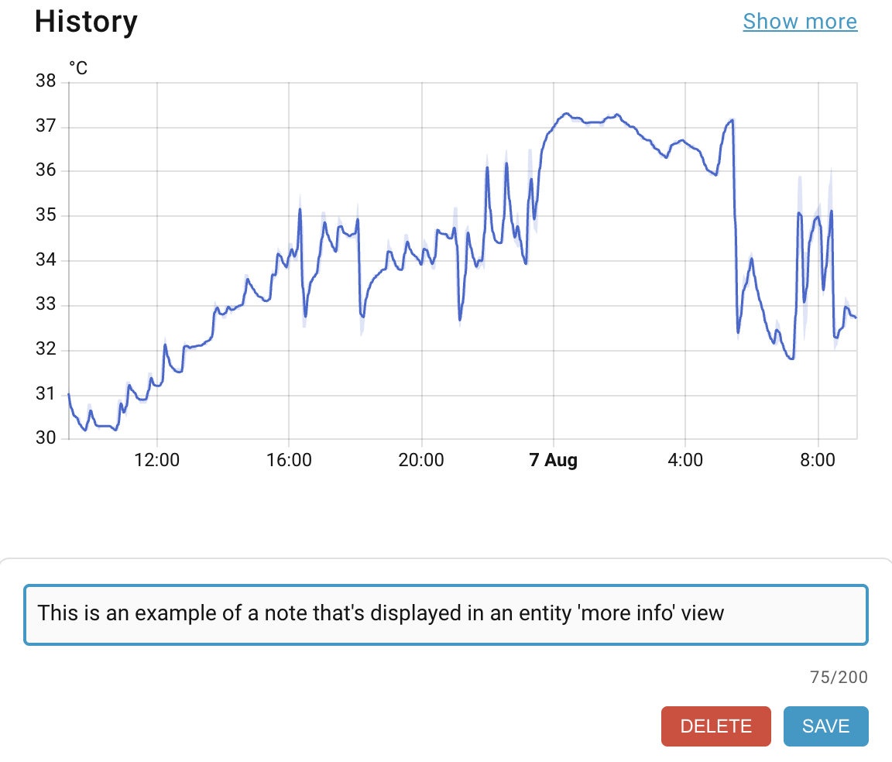

# Entity Notes

Add a simple “Notes” section to any entity’s **More info** dialog so you can keep device locations, maintenance hints, wiring details, and other context right where you need it.

## Features
- Add notes to any entity (lights, sensors, switches, etc.)
- Notes persist across restarts
- Clean, auto-resizing input field
- Desktop & mobile friendly

## Installation
This integration is available in the [HACS default repository](https://github.com/hacs/default).

1. In Home Assistant, open **HACS → Integrations**  
2. Search for **Entity Notes**  
3. Install the integration  
4. **Restart Home Assistant**

## Usage
1. Click any entity to open **More info**  
2. Scroll to **Notes**  
3. Type your note and **Save** (use **Delete** to clear a note)

### Tips
- Empty notes are cleaned up automatically  
- Notes are stored locally in your HA instance  

## Support
- Report bugs or suggest features: [GitHub Issues](https://github.com/martindell/ha-entity-notes/issues)
